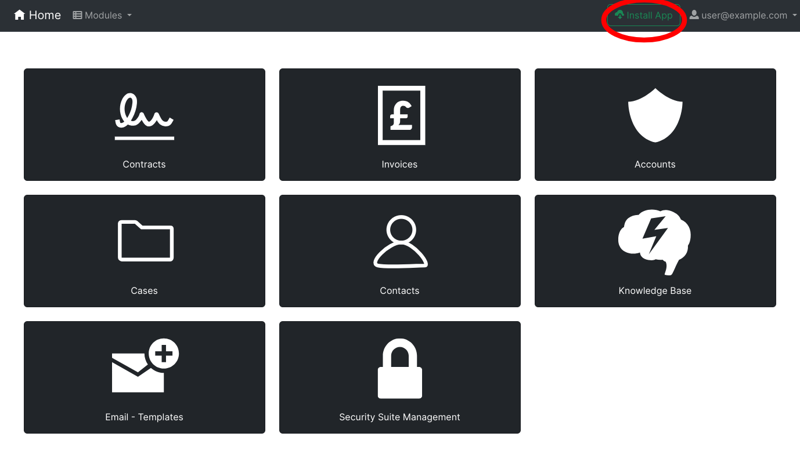
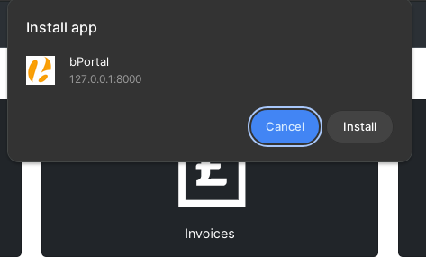
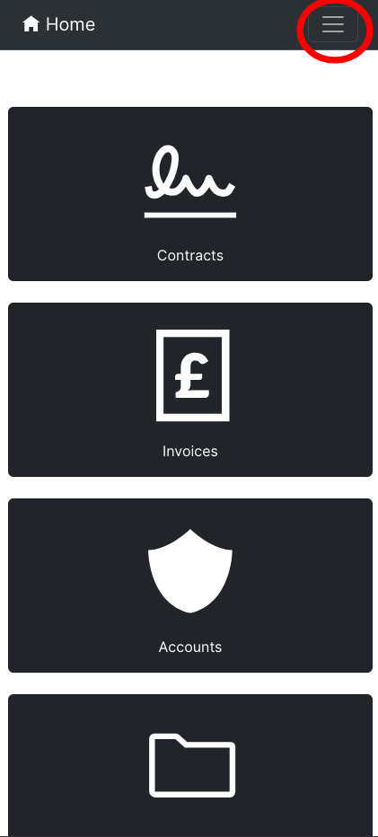
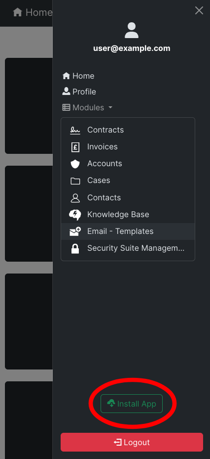
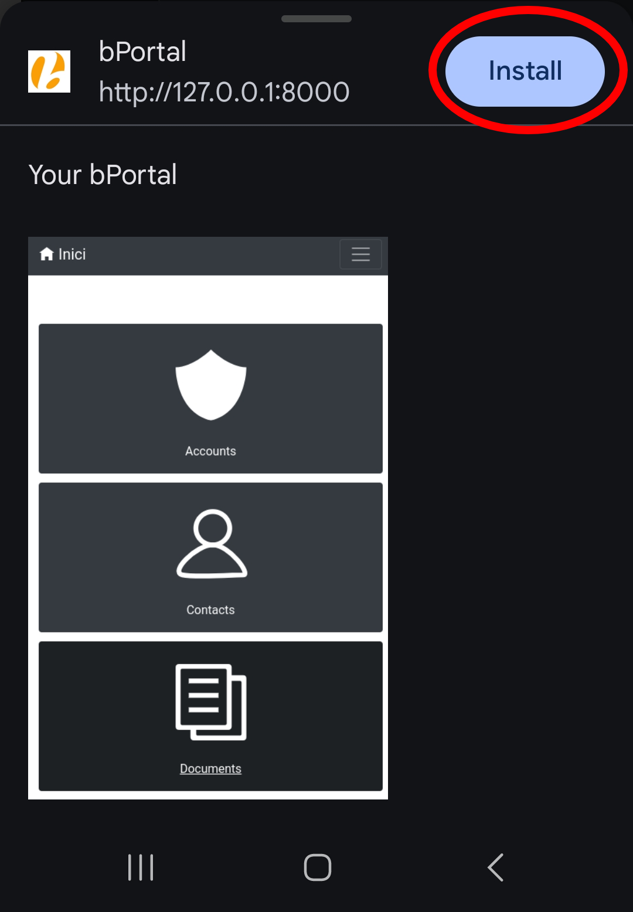
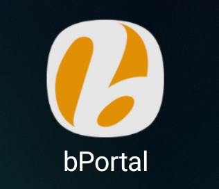

# Installation of bPortal Application (PWA)
This document describes the steps to install the bPortal application as a Progressive Web App (PWA).

## Devices
The bPortal can be installed as an app on your computer, mobile, and tablet devices.

## Compatible browsers
Not all browsers are compatible with the PWA. Below is a list of supported browsers:

- **Chromium-based browsers**
  - Google Chrome
  - Chromium
  - Microsoft Edge
  - Brave
  - ...
- Samsung Internet
- Firefox
  - Only for desktop, and you need to install an extension.
- ...

## Installation steps
The steps to install the bPortal application are:

### Installation on desktop devices

1. **Open bPortal in your browser**: Navigate to the bPortal website using a compatible browser.

2. **Locate the `Install App` button**: After logging in to your bPortal account, you will find a button labeled `Install App` in the top bar. This button simplifies the installation process.

    </img>

3. **Click the `Install App` button**: Once you click the button, a prompt will appear asking you to confirm the installation.

    </img>

4. **Confirm the installation**: Click `Install` in the prompt to proceed with the installation.

5. **Access the PWA**: After installation, the bPortal PWA will be available on your desktop device, just like a native app.

    </img>

### Installation on mobile devices

1. **Open bPortal in your browser**: Navigate to the bPortal website using a compatible browser.

2. **Open the sidebar**: After logging in, tap the top-right button to open the sidebar. 

    </img>

3. **Locate the `Install App` button**: With the sidebar open, you will find a button labeled `Install App`. This button simplifies the installation process.

    </img>

4. **Click the `Install App` button**: Once you click the button, a prompt will appear asking you to confirm the installation.

    </img>

5. **Confirm the installation**: Click `Install` in the prompt to proceed with the installation.

6. **Access the PWA**: After installation, the bPortal PWA will be available on your device's home screen or app drawer, just like a native app.

    </img>

### Other installations
For some browsers that support PWA, the `Install App` button may not appear. You need to follow the **official documentation** for these browsers to manually install the app.
