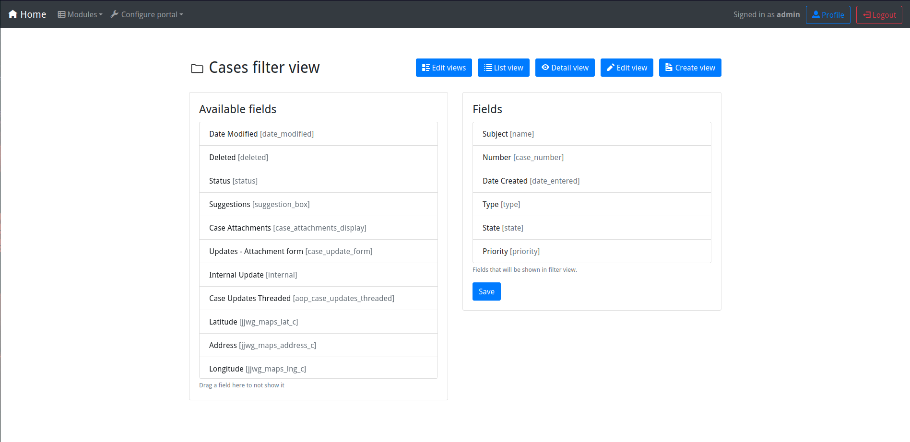
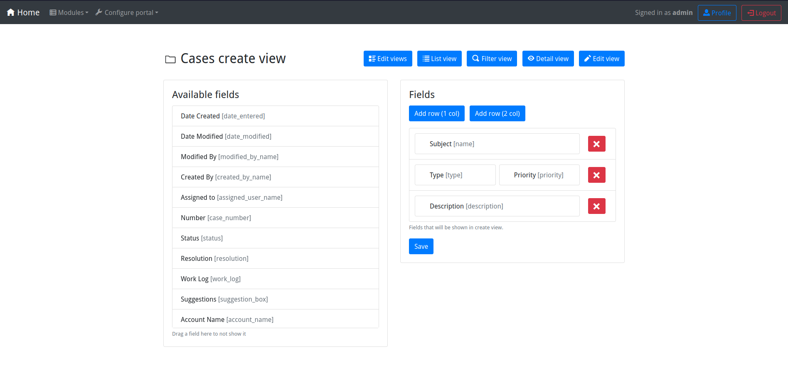

# Portal user

  
_User Home_

---

  
_Create new case_

---

  
_Case detail_  
  
_Case detail on SuiteCRM_

---

_List of cases_

# Portal admin

  
_Configure cases list view_

---

  
_Configure cases filter view_

---

  
_Configure cases detail view_

---

  
_Configure cases create view_

---

  
_Configure cases edit view_

---

  
_Configure default role_

---

_Edit user settings_
