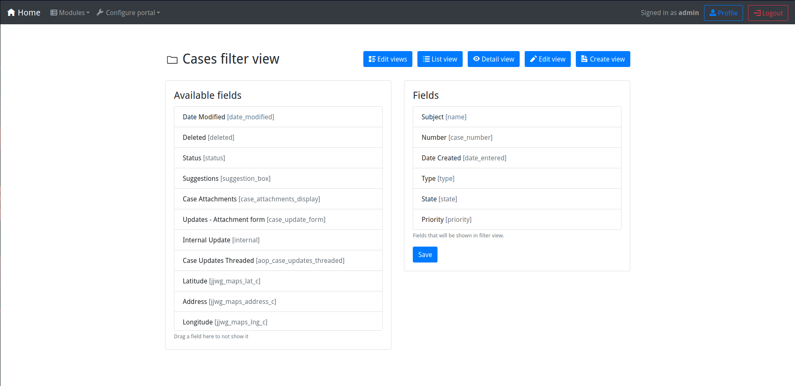

# Portal setup
This document describes how to setup bPortal so that a final user can make a full use of **cases** module.

You need to login as admin.

## Role configuration
The first step you need to do, is configure the role for the final users. To reach the **role configuration** view, go to `Configure portal`, `Edit roles`, and in this view you can create a new role or use the **default** one.

Then click `Edit role` and in this view you need to select which permissons you want for the differents **modules**, if for one module you dont't select anything, this **module** will not appear in the home page. 

For the **cases** module, you need to select the `Read`, `Create` and `Edit`, as you can see below:

The default role is assigned by default to every created user, so if you want to change the role, go to `Configure Portal`, `Edit users`, and then select the user you want to edit, clicking `Edit user`:

And in the `Role` dropdown select the role you want for that user.

## Views configuration
The second step is configure the views for the different modules, this views are the same for all roles you have.

To configure the views, go to `Configure Portal`, `Edit views`, and then you will have a list with all modules and the different views options.

For the **cases** module: 
- **Cases list view**: below you can see how to configure this view, then as user when you click to **cases**, and will show a list with the different cases.

- **Cases filter view**: is used to filter the cases with the fields you want.

- **Cases detail view**: is used to display a detailed view of the case.

- **Cases create view**: this view, is used to create a new case.

- **Cases edit view**: is used to edit a created case. 

Then you need to login as user, and you will be able to create cases, At [screenshots.md](screenshots.md) you have some screenshots of the different views explained before.
